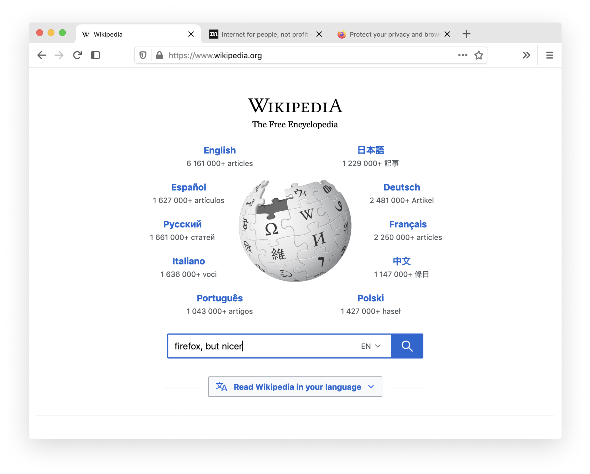

# mike's firefox 🦊

a [userChrome.css](https://www.userchrome.org/) theme that makes firefox a little bit nicer, visually. 

a bunch of lightweight tweaks, including:

- chrome styled curved tabs
- fixed mac os translucency
- normalized button styles
- custom sidebar icon
- color and spacing improvements

all under 200 lines of code, with comments! 👯‍♀️

## installation

1. open firefox
2. click on the three lines menu button (≡) to the right of the navbar
3. click on "Help" at the bottom of the menu
4. click on "Troubleshooting Information"
5. find "Profile Folder" in the table and click "Show in Finder"
6. make a `chrome` folder in your profile folder (the folder that looks like `###.default-###`) if it doesn't already exist
7. download (or `git clone`) this repo and put `userChrome.css` into `chrome/`
8. enter `about:config` in the address bar, and find `userprof`
9. change `toolkit.legacyUserProfileCustomizations.stylesheets` from `false` to `true`
10. restart firefox
11. set your theme, under "Customize" in the three lines menu (≡), to either "Default" for a dark theme, or to "Light" for the light theme (recommended)
12. enjoy `:~)`

you could also `git clone` and rename/symlink the repo to `chrome/` if you'd like to pull updates and bugfixes periodically

## inspiration

- [Modern Firefox (u/LordEverin)](https://www.reddit.com/r/FirefoxCSS/comments/bm77hx/modern_firefox/)
- [MaterialFox (muckSponge)](https://github.com/muckSponge/MaterialFox)
- Learn more about userChrome.css [here (unofficial)](https://www.userchrome.org/)
- Find more Firefox customizations on [r/FirefoxCSS](https://www.reddit.com/r/FirefoxCSS)
